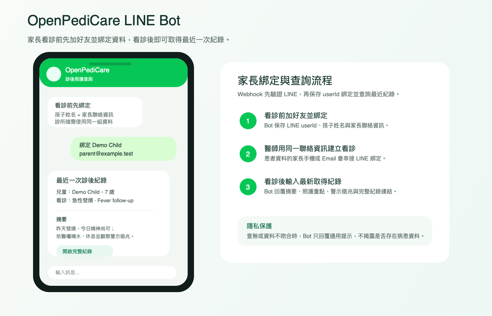

# OpenPediCare

OpenPediCare 是兒科診後照護工作台。醫師一開始只需輸入兒童姓名、年齡與性別，接著可直接錄音看診內容；系統會顯示唯讀即時逐字稿，停止錄音後可選擇跳過或補充醫師備註，再產生：

- 看診摘要
- 家長衛教內容
- 依年齡調整的患者衛教內容
- 家長查閱頁與 PDF

[English README](README.md)

## Docker 快速啟動

```bash
cp .env.example .env
docker compose up --build
```

開啟：

```text
http://localhost:8000
```

Demo 帳號：

```text
醫師：doctor@example.test / Doctor123!
家長：parent@example.test / Parent123!
```

若 `8000` 被占用：

```bash
docker build -t openpedicare:local .
docker run -d --name openpedicare_live -p 8002:8000 --env-file .env \
  -v "$PWD/data:/app/data" \
  -v "$PWD/media:/app/media" \
  openpedicare:local
```

## AI API 設定

預設使用 ikuncode：

```text
AI_PROVIDER=ikuncode
IKUNCODE_API_KEY=你的_ikuncode_key
IKUNCODE_BASE_URL=https://api.ikuncode.cc/v1
IKUNCODE_MODEL=gpt-5.4-mini
```

切換 OpenAI-compatible 設定：

```text
AI_PROVIDER=openai
OPENAI_API_KEY=你的_openai_key
OPENAI_BASE_URL=https://api.openai.com/v1
OPENAI_CHAT_MODEL=gpt-5.4-mini
```

沒有 AI key 時會使用本機 mock fallback，方便測 UI 與流程；正式臨床文件請勿使用 mock。

## LINE Bot 家長查詢



OpenPediCare 已內建 LINE Messaging API webhook，支援完整家長流程：家長在看診前先加入 LINE Bot 好友並綁定孩子資料，看診後即可用同一個 LINE 帳號取得最近一次已產生的診後紀錄。

Webhook URL：

```text
https://你的公開網域/linebot/webhook
```

家長流程：

1. 看診前，家長先加入 LINE 官方帳號好友。
2. 家長在一對一聊天室綁定孩子姓名與家長手機或 Email。
3. 醫師建立或選擇患者時，使用同一組家長手機或 Email。
4. 看診完成並產生診後紀錄後，家長輸入 `最新`。

家長輸入範例：

```text
綁定 Demo Child +1-555-0100
綁定 Demo Child parent@example.test
姓名：Demo Child
Email：parent@example.test
最新
```

`.env` 必填：

```text
LINE_CHANNEL_SECRET=你的_LINE_channel_secret
LINE_CHANNEL_ACCESS_TOKEN=你的_LINE_channel_access_token
LINEBOT_PUBLIC_BASE_URL=https://你的公開網域
```

流程會先驗證 `X-Line-Signature`。綁定時會保存 LINE userId、孩子姓名與家長手機或 Email；後續查詢會用同一個 LINE userId，加上患者資料中的家長聯絡資訊比對。吻合時，Bot 會回覆最近一次看診摘要、家長照護重點、警示徵兆、追蹤計畫與完整家長頁連結；不吻合時只回覆通用提示，避免揭露病患是否存在。

正式上線請保持 `LINEBOT_REQUIRE_SIGNATURE=True`。若只想讓 LINE 顯示醫師已核准的紀錄，請設定 `LINEBOT_ONLY_APPROVED_VISITS=True`。

## 四宮格漫畫

漫畫功能使用 OpenAI image generation。只有填入以下 key 時，畫面才會出現「Generate comic」按鈕：

```text
OPENAI_IMAGE_API_KEY=你的_openai_image_key
OPENAI_IMAGE_BASE_URL=https://api.openai.com/v1
OPENAI_IMAGE_MODEL=gpt-image-1-mini
```
## 即時語音

- 建議 Chrome 或 Edge。
- `localhost` 可直接使用麥克風。
- 手機或外部測試請使用 ngrok HTTPS 網址。
- 即時逐字稿對使用者為唯讀。
- 每句話會自動換行。
- 暫停與繼續是同一顆按鈕。
- 停止後再開始同一診次時，不會重複複製上一段逐字稿。

## 使用流程

醫師：

1. 登入醫師工作台。
2. 輸入姓名、年齡、性別，或在回診患者區選擇既有兒童。
3. 開始錄音。
4. 檢查唯讀逐字稿。
5. 暫停、繼續或停止錄音。
6. 跳過備註或填寫醫師補充。
7. 產生看診摘要、家長衛教與患者衛教。
8. 查看家長連結與PDF。

回診患者：

- 回診患者放在「即時看診」分頁內，而不是歷史紀錄。
- 歷史分頁只保留近期分析。
- 未來可延伸成父母帳號綁定、回診原因、成長紀錄、用藥史與前次診次比較。

家長：

1. 登入家長帳號。
2. 查看已連結診次。
3. 開啟家長衛教與PDF。
4. 也可使用醫師分享的家長查閱連結。

語言：

- UI 預設英文。
- 右上角可切換英文與繁體中文。

## ngrok

```bash
docker compose --profile tunnel up --build
```

查看公開網址：

```text
http://localhost:4040
```

## 本機開發

```bash
python3 -m venv .venv
.venv/bin/pip install -r requirements.txt
.venv/bin/python manage.py migrate
.venv/bin/python manage.py seed_demo
.venv/bin/python manage.py runserver 0.0.0.0:8000
```

測試：

```bash
.venv/bin/python manage.py test
```

## 注意事項

OpenPediCare 是診後溝通與衛教輔助工具，不是診斷裝置，也不取代醫師臨床判斷。正式公開部署前請更換所有 secret、關閉 debug、設定 HTTPS、審查資料保存政策，並依醫療場域要求完成資安與合規檢核。

LINE 整合依照官方 [webhook signature verification](https://developers.line.biz/en/docs/messaging-api/verify-webhook-signature/) 與 [reply message](https://developers.line.biz/en/reference/messaging-api/#send-reply-message) 要求實作。
